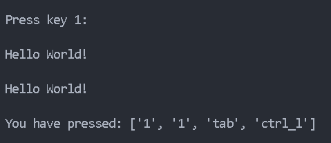

# Script-Python-KeyLogger

Project #3 with Python. Script to capture the selected keys.

When executing the file, print the program to the console
this text "Press key 1: ", after pressing
the key one, print another text, you can modify this action
to perform events according to the key you press.

You can also press all the keys you want,
and pressing the ESC key will print in list type
all selected characters.

**Image 1**

<i>Best respect !!! </i>

**<cite>Author: Francisco Velez</cite>**
